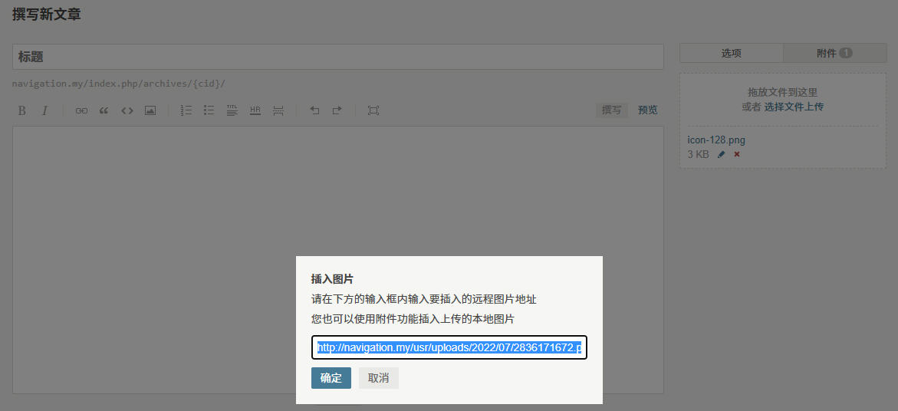
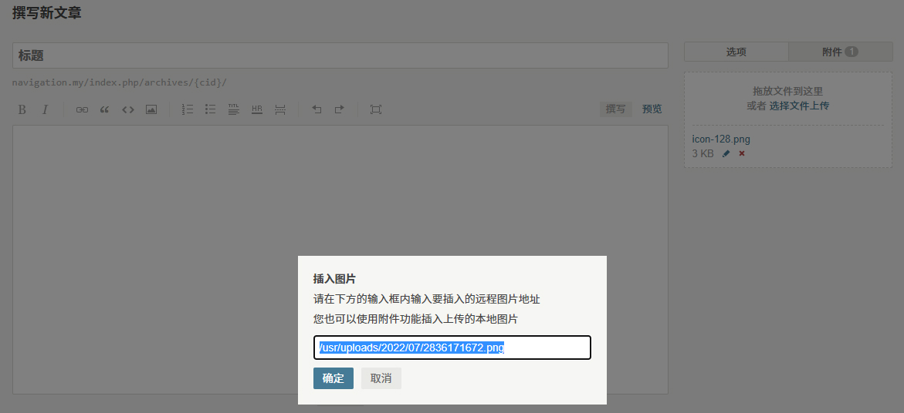

# RelativePathOfAttachment

> Typecho Plugin

## 简介

这是一个用于 Typecho 博客程序的插件，使博客程序在上传附件时返回的附件地址为路径地址而非完整地址。

例如，这是使用插件之前上传附件时返回的附件地址结果：

- 

这是使用插件之后上传附件时返回的附件地址结果：

- 

## 安装方法

1. 前往 [Releases](https://github.com/LightAPIs/RelativePathOfAttachment/releases/latest) 下载插件压缩包文件。
2. 解压所下载的插件压缩包文件，得到 `RelativePathOfAttachment` 目录，将其上传至服务器 Typecho 插件安装目录 `/usr/plugins/`。
3. 在浏览器里打开 Typecho 后台插件管理页面(默认：`/admin/plugins.php`)，启用该插件即可。

## License

[GPL-3.0](./LICENSE) license
